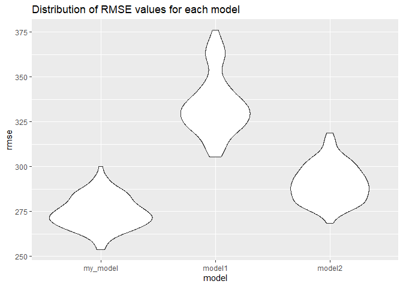
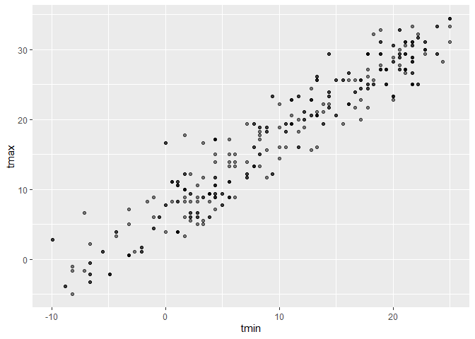

p8105\_hw6\_xl2851
================
xinran
11/15/2019

``` r
library(tidyverse)
```

    ## -- Attaching packages --------------------------------------- tidyverse 1.2.1 --

    ## v ggplot2 3.2.1     v purrr   0.3.3
    ## v tibble  2.1.3     v dplyr   0.8.3
    ## v tidyr   1.0.0     v stringr 1.4.0
    ## v readr   1.3.1     v forcats 0.4.0

    ## -- Conflicts ------------------------------------------ tidyverse_conflicts() --
    ## x dplyr::filter() masks stats::filter()
    ## x dplyr::lag()    masks stats::lag()

``` r
library(modelr)
```

# question 1

``` r
bw_data= read_csv('./data/birthweight.csv')
```

    ## Parsed with column specification:
    ## cols(
    ##   .default = col_double()
    ## )

    ## See spec(...) for full column specifications.

clean the data

``` r
bw_tidy=
bw_data%>%
  mutate(
  babysex=as.factor(babysex),
  babysex=recode(babysex,"1"="male", "2"="female"),
  frace=as.factor(frace),
  frace=recode(frace,"1"="white", "2"="black","3"="asian", "4"="puerto rican", "8"="other","9"="unknown"),
  malform=as.factor(malform),
  malform=recode(malform,"1"="present", "0"="absent"),
  mrace=as.factor(mrace),
  mrace=recode(mrace, "1"="white", "2"="black","3"="asian", "4"="puerto rican", "8"="other"))
```

``` r
anyNA(bw_tidy)
```

    ## [1] FALSE

The result is FALSE. There is no missing
value.

``` r
# fit a regression using all predictors and do elimataion with alpha = 0.05
all_x = lm(bwt ~ ., data = bw_tidy)
summary(all_x)
```

    ## 
    ## Call:
    ## lm(formula = bwt ~ ., data = bw_tidy)
    ## 
    ## Residuals:
    ##      Min       1Q   Median       3Q      Max 
    ## -1097.68  -184.86    -3.33   173.09  2344.15 
    ## 
    ## Coefficients: (3 not defined because of singularities)
    ##                     Estimate Std. Error t value Pr(>|t|)    
    ## (Intercept)       -6265.3914   660.4011  -9.487  < 2e-16 ***
    ## babysexfemale        28.7073     8.4652   3.391 0.000702 ***
    ## bhead               130.7781     3.4523  37.881  < 2e-16 ***
    ## blength              74.9536     2.0217  37.075  < 2e-16 ***
    ## delwt                 4.1007     0.3948  10.386  < 2e-16 ***
    ## fincome               0.2898     0.1795   1.614 0.106551    
    ## fraceblack           14.3313    46.1501   0.311 0.756168    
    ## fraceasian           21.2361    69.2960   0.306 0.759273    
    ## fracepuerto rican   -46.9962    44.6782  -1.052 0.292912    
    ## fraceother            4.2969    74.0741   0.058 0.953745    
    ## gaweeks              11.5494     1.4654   7.882 4.06e-15 ***
    ## malformpresent        9.7650    70.6259   0.138 0.890039    
    ## menarche             -3.5508     2.8951  -1.226 0.220083    
    ## mheight               9.7874    10.3116   0.949 0.342588    
    ## momage                0.7593     1.2221   0.621 0.534418    
    ## mraceblack         -151.4354    46.0453  -3.289 0.001014 ** 
    ## mraceasian          -91.3866    71.9190  -1.271 0.203908    
    ## mracepuerto rican   -56.4787    45.1369  -1.251 0.210901    
    ## parity               95.5411    40.4793   2.360 0.018307 *  
    ## pnumlbw                   NA         NA      NA       NA    
    ## pnumsga                   NA         NA      NA       NA    
    ## ppbmi                 4.3538    14.8913   0.292 0.770017    
    ## ppwt                 -3.4716     2.6121  -1.329 0.183913    
    ## smoken               -4.8544     0.5871  -8.269  < 2e-16 ***
    ## wtgain                    NA         NA      NA       NA    
    ## ---
    ## Signif. codes:  0 '***' 0.001 '**' 0.01 '*' 0.05 '.' 0.1 ' ' 1
    ## 
    ## Residual standard error: 272.5 on 4320 degrees of freedom
    ## Multiple R-squared:  0.7183, Adjusted R-squared:  0.717 
    ## F-statistic: 524.6 on 21 and 4320 DF,  p-value: < 2.2e-16

``` r
# take out 3 predictors because of singularities
step1 = update(all_x, . ~ . -pnumlbw -pnumsga -wtgain)
summary(step1)
```

    ## 
    ## Call:
    ## lm(formula = bwt ~ babysex + bhead + blength + delwt + fincome + 
    ##     frace + gaweeks + malform + menarche + mheight + momage + 
    ##     mrace + parity + ppbmi + ppwt + smoken, data = bw_tidy)
    ## 
    ## Residuals:
    ##      Min       1Q   Median       3Q      Max 
    ## -1097.68  -184.86    -3.33   173.09  2344.15 
    ## 
    ## Coefficients:
    ##                     Estimate Std. Error t value Pr(>|t|)    
    ## (Intercept)       -6265.3914   660.4011  -9.487  < 2e-16 ***
    ## babysexfemale        28.7073     8.4652   3.391 0.000702 ***
    ## bhead               130.7781     3.4523  37.881  < 2e-16 ***
    ## blength              74.9536     2.0217  37.075  < 2e-16 ***
    ## delwt                 4.1007     0.3948  10.386  < 2e-16 ***
    ## fincome               0.2898     0.1795   1.614 0.106551    
    ## fraceblack           14.3313    46.1501   0.311 0.756168    
    ## fraceasian           21.2361    69.2960   0.306 0.759273    
    ## fracepuerto rican   -46.9962    44.6782  -1.052 0.292912    
    ## fraceother            4.2969    74.0741   0.058 0.953745    
    ## gaweeks              11.5494     1.4654   7.882 4.06e-15 ***
    ## malformpresent        9.7650    70.6259   0.138 0.890039    
    ## menarche             -3.5508     2.8951  -1.226 0.220083    
    ## mheight               9.7874    10.3116   0.949 0.342588    
    ## momage                0.7593     1.2221   0.621 0.534418    
    ## mraceblack         -151.4354    46.0453  -3.289 0.001014 ** 
    ## mraceasian          -91.3866    71.9190  -1.271 0.203908    
    ## mracepuerto rican   -56.4787    45.1369  -1.251 0.210901    
    ## parity               95.5411    40.4793   2.360 0.018307 *  
    ## ppbmi                 4.3538    14.8913   0.292 0.770017    
    ## ppwt                 -3.4716     2.6121  -1.329 0.183913    
    ## smoken               -4.8544     0.5871  -8.269  < 2e-16 ***
    ## ---
    ## Signif. codes:  0 '***' 0.001 '**' 0.01 '*' 0.05 '.' 0.1 ' ' 1
    ## 
    ## Residual standard error: 272.5 on 4320 degrees of freedom
    ## Multiple R-squared:  0.7183, Adjusted R-squared:  0.717 
    ## F-statistic: 524.6 on 21 and 4320 DF,  p-value: < 2.2e-16

``` r
# take out frace since frace factor 8 has the highest p-value(0.953745)
step2 = update(step1, . ~ . -frace)
summary(step2)
```

    ## 
    ## Call:
    ## lm(formula = bwt ~ babysex + bhead + blength + delwt + fincome + 
    ##     gaweeks + malform + menarche + mheight + momage + mrace + 
    ##     parity + ppbmi + ppwt + smoken, data = bw_tidy)
    ## 
    ## Residuals:
    ##     Min      1Q  Median      3Q     Max 
    ## -1097.2  -185.0    -3.4   173.5  2343.0 
    ## 
    ## Coefficients:
    ##                     Estimate Std. Error t value Pr(>|t|)    
    ## (Intercept)       -6275.7539   660.1055  -9.507  < 2e-16 ***
    ## babysexfemale        28.6774     8.4624   3.389 0.000708 ***
    ## bhead               130.7957     3.4498  37.914  < 2e-16 ***
    ## blength              74.9120     2.0205  37.075  < 2e-16 ***
    ## delwt                 4.0999     0.3945  10.392  < 2e-16 ***
    ## fincome               0.2900     0.1792   1.619 0.105601    
    ## gaweeks              11.5653     1.4649   7.895 3.65e-15 ***
    ## malformpresent        9.8604    70.6042   0.140 0.888937    
    ## menarche             -3.6117     2.8923  -1.249 0.211826    
    ## mheight               9.9748    10.3066   0.968 0.333191    
    ## momage                0.7549     1.2207   0.618 0.536323    
    ## mraceblack         -137.2032    10.2150 -13.432  < 2e-16 ***
    ## mraceasian          -73.8582    42.7892  -1.726 0.084402 .  
    ## mracepuerto rican   -99.1585    19.3862  -5.115 3.28e-07 ***
    ## parity               95.6671    40.4678   2.364 0.018121 *  
    ## ppbmi                 4.5635    14.8839   0.307 0.759159    
    ## ppwt                 -3.5082     2.6110  -1.344 0.179136    
    ## smoken               -4.8281     0.5860  -8.239 2.29e-16 ***
    ## ---
    ## Signif. codes:  0 '***' 0.001 '**' 0.01 '*' 0.05 '.' 0.1 ' ' 1
    ## 
    ## Residual standard error: 272.4 on 4324 degrees of freedom
    ## Multiple R-squared:  0.7182, Adjusted R-squared:  0.7171 
    ## F-statistic: 648.3 on 17 and 4324 DF,  p-value: < 2.2e-16

``` r
# take out malform since malformpresent has the highest p-value(0.888937)
step3 = update(step2, . ~ . -malform)
summary(step3)
```

    ## 
    ## Call:
    ## lm(formula = bwt ~ babysex + bhead + blength + delwt + fincome + 
    ##     gaweeks + menarche + mheight + momage + mrace + parity + 
    ##     ppbmi + ppwt + smoken, data = bw_tidy)
    ## 
    ## Residuals:
    ##      Min       1Q   Median       3Q      Max 
    ## -1097.12  -184.99    -3.41   173.48  2342.82 
    ## 
    ## Coefficients:
    ##                     Estimate Std. Error t value Pr(>|t|)    
    ## (Intercept)       -6274.6909   659.9868  -9.507  < 2e-16 ***
    ## babysexfemale        28.6599     8.4605   3.387 0.000712 ***
    ## bhead               130.7994     3.4493  37.920  < 2e-16 ***
    ## blength              74.9075     2.0201  37.082  < 2e-16 ***
    ## delwt                 4.1017     0.3943  10.403  < 2e-16 ***
    ## fincome               0.2895     0.1791   1.616 0.106120    
    ## gaweeks              11.5632     1.4646   7.895 3.65e-15 ***
    ## menarche             -3.6164     2.8917  -1.251 0.211146    
    ## mheight               9.9613    10.3049   0.967 0.333773    
    ## momage                0.7585     1.2203   0.622 0.534265    
    ## mraceblack         -137.2323    10.2117 -13.439  < 2e-16 ***
    ## mraceasian          -73.9192    42.7821  -1.728 0.084094 .  
    ## mracepuerto rican   -99.2152    19.3798  -5.120 3.20e-07 ***
    ## parity               95.6426    40.4629   2.364 0.018137 *  
    ## ppbmi                 4.5479    14.8818   0.306 0.759922    
    ## ppwt                 -3.5073     2.6106  -1.343 0.179197    
    ## smoken               -4.8262     0.5858  -8.239 2.29e-16 ***
    ## ---
    ## Signif. codes:  0 '***' 0.001 '**' 0.01 '*' 0.05 '.' 0.1 ' ' 1
    ## 
    ## Residual standard error: 272.4 on 4325 degrees of freedom
    ## Multiple R-squared:  0.7182, Adjusted R-squared:  0.7172 
    ## F-statistic:   689 on 16 and 4325 DF,  p-value: < 2.2e-16

``` r
# take out ppbmi since it has the highest p-value(0.759922)
step4 = update(step3, . ~ . -ppbmi)
summary(step4)
```

    ## 
    ## Call:
    ## lm(formula = bwt ~ babysex + bhead + blength + delwt + fincome + 
    ##     gaweeks + menarche + mheight + momage + mrace + parity + 
    ##     ppwt + smoken, data = bw_tidy)
    ## 
    ## Residuals:
    ##      Min       1Q   Median       3Q      Max 
    ## -1095.57  -185.07    -3.22   173.66  2342.79 
    ## 
    ## Coefficients:
    ##                     Estimate Std. Error t value Pr(>|t|)    
    ## (Intercept)       -6077.6038   140.2391 -43.337  < 2e-16 ***
    ## babysexfemale        28.6376     8.4593   3.385 0.000717 ***
    ## bhead               130.8308     3.4474  37.950  < 2e-16 ***
    ## blength              74.9102     2.0198  37.087  < 2e-16 ***
    ## delwt                 4.1004     0.3942  10.402  < 2e-16 ***
    ## fincome               0.2905     0.1791   1.622 0.104816    
    ## gaweeks              11.5597     1.4644   7.894 3.69e-15 ***
    ## menarche             -3.6401     2.8904  -1.259 0.207963    
    ## mheight               6.8604     1.7989   3.814 0.000139 ***
    ## momage                0.7656     1.2199   0.628 0.530319    
    ## mraceblack         -137.2019    10.2102 -13.438  < 2e-16 ***
    ## mraceasian          -74.6165    42.7167  -1.747 0.080747 .  
    ## mracepuerto rican   -99.4288    19.3652  -5.134 2.95e-07 ***
    ## parity               95.4592    40.4542   2.360 0.018335 *  
    ## ppwt                 -2.7205     0.4325  -6.290 3.50e-10 ***
    ## smoken               -4.8279     0.5857  -8.243  < 2e-16 ***
    ## ---
    ## Signif. codes:  0 '***' 0.001 '**' 0.01 '*' 0.05 '.' 0.1 ' ' 1
    ## 
    ## Residual standard error: 272.3 on 4326 degrees of freedom
    ## Multiple R-squared:  0.7182, Adjusted R-squared:  0.7172 
    ## F-statistic: 735.1 on 15 and 4326 DF,  p-value: < 2.2e-16

``` r
# take out momage since it has the highest p-value(0.530319)
step5 = update(step4, . ~ . -momage)
summary(step5)
```

    ## 
    ## Call:
    ## lm(formula = bwt ~ babysex + bhead + blength + delwt + fincome + 
    ##     gaweeks + menarche + mheight + mrace + parity + ppwt + smoken, 
    ##     data = bw_tidy)
    ## 
    ## Residuals:
    ##      Min       1Q   Median       3Q      Max 
    ## -1096.14  -184.98    -2.86   173.65  2343.59 
    ## 
    ## Coefficients:
    ##                     Estimate Std. Error t value Pr(>|t|)    
    ## (Intercept)       -6070.1897   139.7308 -43.442  < 2e-16 ***
    ## babysexfemale        28.4769     8.4548   3.368 0.000763 ***
    ## bhead               130.8513     3.4470  37.961  < 2e-16 ***
    ## blength              74.8931     2.0195  37.085  < 2e-16 ***
    ## delwt                 4.0794     0.3927  10.387  < 2e-16 ***
    ## fincome               0.3149     0.1748   1.802 0.071621 .  
    ## gaweeks              11.6105     1.4621   7.941 2.54e-15 ***
    ## menarche             -3.2979     2.8383  -1.162 0.245327    
    ## mheight               6.8542     1.7988   3.810 0.000141 ***
    ## mraceblack         -138.7506     9.9068 -14.006  < 2e-16 ***
    ## mraceasian          -71.4559    42.4158  -1.685 0.092128 .  
    ## mracepuerto rican  -100.1555    19.3291  -5.182 2.30e-07 ***
    ## parity               97.3088    40.3438   2.412 0.015907 *  
    ## ppwt                 -2.6787     0.4273  -6.268 4.01e-10 ***
    ## smoken               -4.8305     0.5857  -8.248  < 2e-16 ***
    ## ---
    ## Signif. codes:  0 '***' 0.001 '**' 0.01 '*' 0.05 '.' 0.1 ' ' 1
    ## 
    ## Residual standard error: 272.3 on 4327 degrees of freedom
    ## Multiple R-squared:  0.7182, Adjusted R-squared:  0.7173 
    ## F-statistic: 787.7 on 14 and 4327 DF,  p-value: < 2.2e-16

``` r
# take out menarche since it has the highest p-value(0.245327)
step6 = update(step5, . ~ . -menarche)
summary(step6)
```

    ## 
    ## Call:
    ## lm(formula = bwt ~ babysex + bhead + blength + delwt + fincome + 
    ##     gaweeks + mheight + mrace + parity + ppwt + smoken, data = bw_tidy)
    ## 
    ## Residuals:
    ##      Min       1Q   Median       3Q      Max 
    ## -1097.18  -185.52    -3.39   174.14  2353.44 
    ## 
    ## Coefficients:
    ##                     Estimate Std. Error t value Pr(>|t|)    
    ## (Intercept)       -6098.8219   137.5463 -44.340  < 2e-16 ***
    ## babysexfemale        28.5580     8.4549   3.378 0.000737 ***
    ## bhead               130.7770     3.4466  37.944  < 2e-16 ***
    ## blength              74.9471     2.0190  37.120  < 2e-16 ***
    ## delwt                 4.1067     0.3921  10.475  < 2e-16 ***
    ## fincome               0.3180     0.1747   1.820 0.068844 .  
    ## gaweeks              11.5925     1.4621   7.929 2.79e-15 ***
    ## mheight               6.5940     1.7849   3.694 0.000223 ***
    ## mraceblack         -138.7925     9.9071 -14.009  < 2e-16 ***
    ## mraceasian          -74.8868    42.3146  -1.770 0.076837 .  
    ## mracepuerto rican  -100.6781    19.3247  -5.210 1.98e-07 ***
    ## parity               96.3047    40.3362   2.388 0.017004 *  
    ## ppwt                 -2.6756     0.4274  -6.261 4.20e-10 ***
    ## smoken               -4.8434     0.5856  -8.271  < 2e-16 ***
    ## ---
    ## Signif. codes:  0 '***' 0.001 '**' 0.01 '*' 0.05 '.' 0.1 ' ' 1
    ## 
    ## Residual standard error: 272.3 on 4328 degrees of freedom
    ## Multiple R-squared:  0.7181, Adjusted R-squared:  0.7173 
    ## F-statistic: 848.1 on 13 and 4328 DF,  p-value: < 2.2e-16

``` r
# take out fincome
step7 = update(step6, . ~ . -fincome)
summary(step7)
```

    ## 
    ## Call:
    ## lm(formula = bwt ~ babysex + bhead + blength + delwt + gaweeks + 
    ##     mheight + mrace + parity + ppwt + smoken, data = bw_tidy)
    ## 
    ## Residuals:
    ##      Min       1Q   Median       3Q      Max 
    ## -1106.16  -183.65    -2.51   174.67  2338.68 
    ## 
    ## Coefficients:
    ##                     Estimate Std. Error t value Pr(>|t|)    
    ## (Intercept)       -6101.8188   137.5732 -44.353  < 2e-16 ***
    ## babysexfemale        28.3735     8.4565   3.355 0.000800 ***
    ## bhead               131.0228     3.4448  38.035  < 2e-16 ***
    ## blength              74.7933     2.0178  37.066  < 2e-16 ***
    ## delwt                 4.0840     0.3920  10.419  < 2e-16 ***
    ## gaweeks              11.6785     1.4617   7.990 1.72e-15 ***
    ## mheight               6.8569     1.7795   3.853 0.000118 ***
    ## mraceblack         -145.3753     9.2256 -15.758  < 2e-16 ***
    ## mraceasian          -77.9781    42.2918  -1.844 0.065279 .  
    ## mracepuerto rican  -105.9871    19.1083  -5.547 3.09e-08 ***
    ## parity               94.8103    40.3386   2.350 0.018800 *  
    ## ppwt                 -2.6507     0.4273  -6.204 6.02e-10 ***
    ## smoken               -4.8738     0.5855  -8.324  < 2e-16 ***
    ## ---
    ## Signif. codes:  0 '***' 0.001 '**' 0.01 '*' 0.05 '.' 0.1 ' ' 1
    ## 
    ## Residual standard error: 272.4 on 4329 degrees of freedom
    ## Multiple R-squared:  0.7179, Adjusted R-squared:  0.7171 
    ## F-statistic:   918 on 12 and 4329 DF,  p-value: < 2.2e-16

``` r
# take out mrace since one of the races(asian) has p-value>0.05
step8 = update(step7, . ~ . -mrace)
summary(step8)
```

    ## 
    ## Call:
    ## lm(formula = bwt ~ babysex + bhead + blength + delwt + gaweeks + 
    ##     mheight + parity + ppwt + smoken, data = bw_tidy)
    ## 
    ## Residuals:
    ##      Min       1Q   Median       3Q      Max 
    ## -1090.67  -180.43    -6.83   176.33  2495.11 
    ## 
    ## Coefficients:
    ##                 Estimate Std. Error t value Pr(>|t|)    
    ## (Intercept)   -6716.9029   134.7922 -49.832  < 2e-16 ***
    ## babysexfemale    29.3662     8.6833   3.382 0.000726 ***
    ## bhead           136.4950     3.5146  38.837  < 2e-16 ***
    ## blength          77.5095     2.0673  37.493  < 2e-16 ***
    ## delwt             3.7003     0.4020   9.205  < 2e-16 ***
    ## gaweeks          13.8986     1.4956   9.293  < 2e-16 ***
    ## mheight           9.5975     1.7875   5.369 8.32e-08 ***
    ## parity           99.1233    41.4750   2.390 0.016893 *  
    ## ppwt             -2.5806     0.4390  -5.879 4.45e-09 ***
    ## smoken           -2.3756     0.5794  -4.100 4.20e-05 ***
    ## ---
    ## Signif. codes:  0 '***' 0.001 '**' 0.01 '*' 0.05 '.' 0.1 ' ' 1
    ## 
    ## Residual standard error: 280.1 on 4332 degrees of freedom
    ## Multiple R-squared:  0.7015, Adjusted R-squared:  0.7009 
    ## F-statistic:  1131 on 9 and 4332 DF,  p-value: < 2.2e-16

``` r
## Since adjusted R-square got much lower, we need to include mrace
```

``` r
my_model = lm(bwt ~ babysex + bhead + blength + delwt + gaweeks + mheight + parity + ppwt + smoken + mrace, data = bw_tidy)

my_model %>% 
  broom::tidy() %>% 
  knitr::kable()
```

| term              |      estimate |   std.error |   statistic |   p.value |
| :---------------- | ------------: | ----------: | ----------: | --------: |
| (Intercept)       | \-6101.818798 | 137.5732070 | \-44.353250 | 0.0000000 |
| babysexfemale     |     28.373537 |   8.4565454 |    3.355216 | 0.0007999 |
| bhead             |    131.022837 |   3.4448394 |   38.034527 | 0.0000000 |
| blength           |     74.793285 |   2.0178165 |   37.066446 | 0.0000000 |
| delwt             |      4.084017 |   0.3919651 |   10.419340 | 0.0000000 |
| gaweeks           |     11.678528 |   1.4616912 |    7.989737 | 0.0000000 |
| mheight           |      6.856870 |   1.7795043 |    3.853247 | 0.0001182 |
| parity            |     94.810270 |  40.3386241 |    2.350360 | 0.0187999 |
| ppwt              |    \-2.650707 |   0.4272538 |  \-6.204057 | 0.0000000 |
| smoken            |    \-4.873767 |   0.5854945 |  \-8.324189 | 0.0000000 |
| mraceblack        |  \-145.375290 |   9.2256254 | \-15.757771 | 0.0000000 |
| mraceasian        |   \-77.978100 |  42.2918129 |  \-1.843811 | 0.0652790 |
| mracepuerto rican |  \-105.987106 |  19.1083402 |  \-5.546641 | 0.0000000 |

``` r
my_model %>% 
  broom::glance()
```

    ## # A tibble: 1 x 11
    ##   r.squared adj.r.squared sigma statistic p.value    df  logLik    AIC
    ##       <dbl>         <dbl> <dbl>     <dbl>   <dbl> <int>   <dbl>  <dbl>
    ## 1     0.718         0.717  272.      918.       0    13 -30501. 61031.
    ## # ... with 3 more variables: BIC <dbl>, deviance <dbl>, df.residual <int>

how to visualize with 2 predictors in a plot? it should be linear
regression? how to pick predictors? randomly? plot of model residuals
against fitted values(means predicted values?): what can this plot tell
me?

``` r
bw_tidy %>% 
modelr::add_residuals(my_model) %>% 
modelr::add_predictions(my_model) %>% 
  ggplot(aes(x = pred, y = resid)) + 
  geom_point()+
  geom_hline(yintercept = 0, color = "red") +
  labs(
    title = 'Model residuals against fitted values',
    x = 'Fitted values',
    y = 'Residuals'
  )
```

<!-- -->

model 1:

``` r
model_1 = lm(bwt ~ blength + gaweeks, data = bw_tidy)
model_1 %>% 
  broom::tidy()
```

    ## # A tibble: 3 x 5
    ##   term        estimate std.error statistic  p.value
    ##   <chr>          <dbl>     <dbl>     <dbl>    <dbl>
    ## 1 (Intercept)  -4348.      98.0      -44.4 0.      
    ## 2 blength        129.       1.99      64.6 0.      
    ## 3 gaweeks         27.0      1.72      15.7 2.36e-54

model
2:

``` r
model_2= lm(bwt ~ babysex+bhead+blength+babysex*bhead*blength, data = bw_tidy)
model_2 %>% 
  broom::tidy()
```

    ## # A tibble: 8 x 5
    ##   term                         estimate std.error statistic      p.value
    ##   <chr>                           <dbl>     <dbl>     <dbl>        <dbl>
    ## 1 (Intercept)                 -7177.     1265.       -5.67  0.0000000149
    ## 2 babysexfemale                6375.     1678.        3.80  0.000147    
    ## 3 bhead                         182.       38.1       4.78  0.00000184  
    ## 4 blength                       102.       26.2       3.90  0.0000992   
    ## 5 babysexfemale:bhead          -198.       51.1      -3.88  0.000105    
    ## 6 babysexfemale:blength        -124.       35.1      -3.52  0.000429    
    ## 7 bhead:blength                  -0.554     0.780    -0.710 0.478       
    ## 8 babysexfemale:bhead:blength     3.88      1.06      3.67  0.000245

cross validation

``` r
cv_df = 
  crossv_mc(bw_tidy, 100)%>% 
  mutate(
    train = map(train, as_tibble),
    test = map(test, as_tibble))
```

``` r
cv_df = 
  cv_df %>% 
  mutate(my_model = map(train, ~lm(bwt ~ babysex + bhead + blength + delwt + gaweeks + mheight + parity + ppwt + smoken + mrace, data = .x)),
         model_1= map(train, ~lm(bwt ~ blength + gaweeks, data = .x)),
         model_2= map(train, ~lm(bwt ~ babysex+bhead+blength+babysex*bhead*blength, data=.x))) %>% 
  mutate(rmse_my_model = map2_dbl(my_model, test, ~rmse(model = .x, data = .y)),
         rmse_model1= map2_dbl(model_1, test, ~rmse(model = .x, data = .y)),
         rmse_model2 = map2_dbl(model_2, test, ~rmse(model = .x, data = .y)))
```

    ## Warning in predict.lm(model, data): prediction from a rank-deficient fit
    ## may be misleading

warning?prediction from a rank-deficient fit may be misleading

``` r
cv_df %>% 
  select(starts_with("rmse")) %>% 
pivot_longer(
    everything(),
    names_to = "model", 
    values_to = "rmse",
    names_prefix = "rmse_") %>% 
  mutate(model = fct_inorder(model)) %>% 
  ggplot(aes(x = model, y = rmse)) + geom_violin()
```

<!-- -->

# quesion 2

``` r
weather_df = 
  rnoaa::meteo_pull_monitors(
    c("USW00094728"),
    var = c("PRCP", "TMIN", "TMAX"), 
    date_min = "2017-01-01",
    date_max = "2017-12-31") %>%
  mutate(
    name = recode(id, USW00094728 = "CentralPark_NY"),
    tmin = tmin / 10,
    tmax = tmax / 10) %>%
  select(name, id, everything())
```

    ## Registered S3 method overwritten by 'crul':
    ##   method                 from
    ##   as.character.form_file httr

    ## Registered S3 method overwritten by 'hoardr':
    ##   method           from
    ##   print.cache_info httr

    ## file path:          C:\Users\xinran\AppData\Local\rnoaa\rnoaa\Cache/ghcnd/USW00094728.dly

    ## file last updated:  2019-09-26 10:37:11

    ## file min/max dates: 1869-01-01 / 2019-09-30

fit a simple linear regression

``` r
weather_df %>% 
  lm(tmax ~ tmin, data = .) %>% 
  broom::tidy()
```

    ## # A tibble: 2 x 5
    ##   term        estimate std.error statistic   p.value
    ##   <chr>          <dbl>     <dbl>     <dbl>     <dbl>
    ## 1 (Intercept)     7.21    0.226       31.8 3.81e-107
    ## 2 tmin            1.04    0.0170      61.2 2.98e-193

write a function to draw a bootstrap sample based on a dataframe.

``` r
boot_sample = function(df) {
  sample_frac(df, size = 1, replace = TRUE)
}
```

``` r
boot_sample(df = weather_df) %>% 
  ggplot(aes(x = tmin, y = tmax)) + 
  geom_point(alpha = .5)
```

<!-- -->

using modelr

``` r
bootstrap_weather=
weather_df %>% 
  modelr::bootstrap(n = 5000) %>% 
  mutate(
    models = map(strap, ~lm(tmax ~ tmin, data = .x) ),
    results = map(models, broom::tidy),
    glance = map(models, broom::glance)) %>% 
  select(-strap, -models) %>% 
  unnest(results,glance)
```

    ## Warning: unnest() has a new interface. See ?unnest for details.
    ## Try `df %>% unnest(c(results, glance))`, with `mutate()` if needed

r\_square

``` r
weather_r2 = 
  bootstrap_weather %>% 
  select(.id, r.squared)

quantile(weather_r2$r.squared, 0.025)
```

    ##      2.5% 
    ## 0.8938312

``` r
quantile(weather_r2$r.squared, 0.975)
```

    ##     97.5% 
    ## 0.9270968

The 95% confidence interval for R-squared is (0.89, 0.93);

``` r
weather_logbetas = 
  bootstrap_weather %>% 
  group_by(.id) %>% 
  summarize(
    boot_logbetas = log(estimate[[1]]*estimate[[2]])
  )
```

Plot the distribution of your estimates, and describe these in words.

``` r
weather_r2=
weather_df %>% 
  modelr::bootstrap(n = 5000) %>% 
  mutate(
    models = map(strap, ~lm(tmax ~ tmin, data = .x) ),
    results = map(models, broom::glance))%>% 
  select(-strap, -models) %>% 
  unnest(results)
```

``` r
weather_r2%>%
  select(r.squared)%>%
  mutate(sd_r2=sd(r.squared),
         mean_r2=mean(r.squared),
         r_low=mean_r2 - qnorm(1-0.05/2)*sd_r2,
         r_high=mean_r2 + qnorm(1-0.05/2)*sd_r2,
         q_2.5=quantile(r.squared,c(.025)),
         q_97.5=quantile(r.squared,c(.975)))%>%
  select(-r.squared)%>%
  head(1)
```

    ## # A tibble: 1 x 6
    ##     sd_r2 mean_r2 r_low r_high q_2.5 q_97.5
    ##     <dbl>   <dbl> <dbl>  <dbl> <dbl>  <dbl>
    ## 1 0.00866   0.911 0.894  0.928 0.893  0.927

``` r
weather_df %>% 
  lm(tmax ~ tmin, data = .) %>% 
  broom::tidy()
```

    ## # A tibble: 2 x 5
    ##   term        estimate std.error statistic   p.value
    ##   <chr>          <dbl>     <dbl>     <dbl>     <dbl>
    ## 1 (Intercept)     7.21    0.226       31.8 3.81e-107
    ## 2 tmin            1.04    0.0170      61.2 2.98e-193
